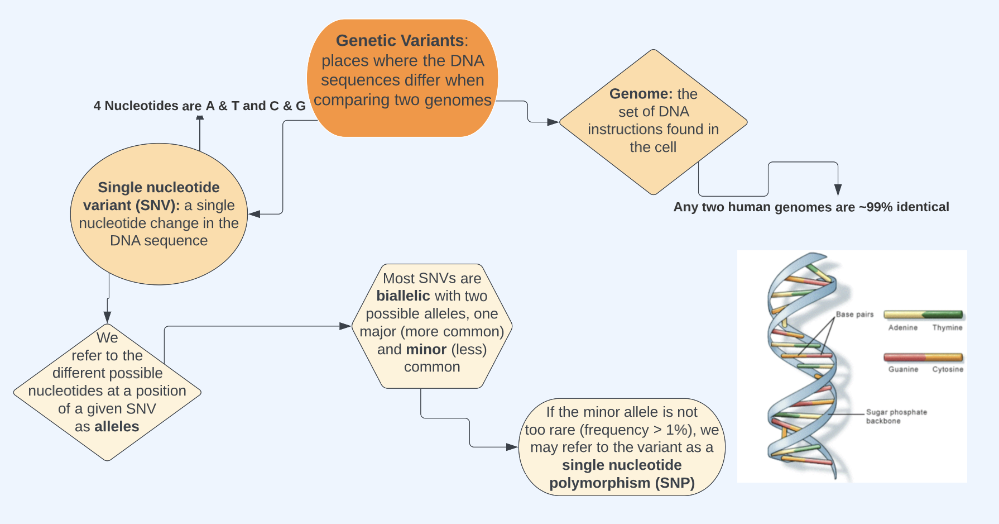
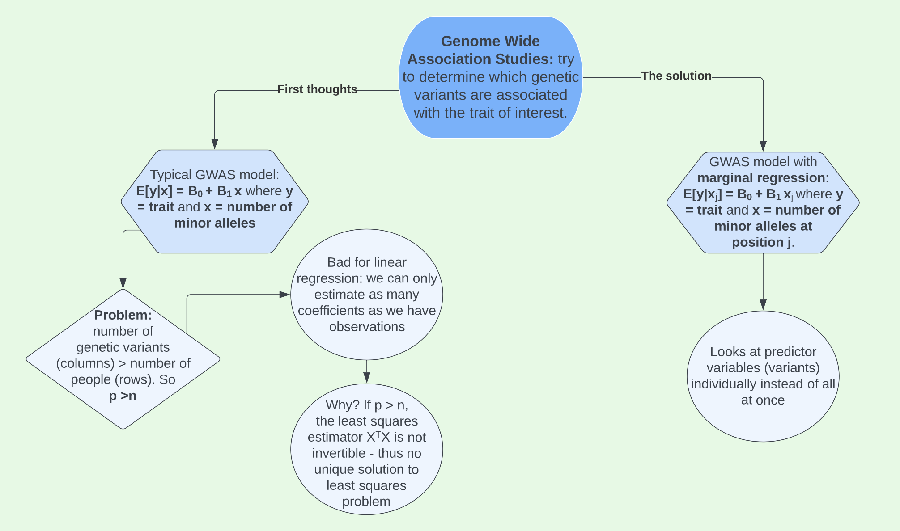

```{r setup, include=FALSE}
knitr::opts_chunk$set(echo = TRUE)
```

## The Genetics part

Statistical genetics is based around studying **genetic variants**.

{width='90%'}

We can study these genetic variants with something known as a **Genetic- Wide Association Study (GWAS)**.

{width='90%'}

## The Statistics part 

As mentioned above, linear regression won't work for a GWAS study. As a result, we can implement **marginal regression**. The following example will use data found on [R-bloggers](https://www.r-bloggers.com/2017/10/genome-wide-association-studies-in-r/) which includes 323 individuals (110 Chinese, 105 Indian and 108 Malay) and 2,527,458 SNPs.

### Data loading and organization

The following code chunks outline the steps of importing the genetic data. 

Load libraries:
```{r, message=FALSE, warning=FALSE}
library(snpStats)
library(tidyverse)
library(broom)
library(NatParksPalettes)
```

Load data for the Chinese, Indian, and Malay individuals and combine them into one `SnpMatrix`. This process uses `read.plink()`, which reads a genotype matrix, information on the study's individuals, and information on the SNPs.
```{r, cache=TRUE}
load("/Users/erinfranke/Desktop/GWAStutorial-master/conversionTable.RData")

pathM <- paste("/Users/erinfranke/Desktop/GWAStutorial-master/public/Genomics/108Malay_2527458snps", c(".bed", ".bim", ".fam"), sep = "")
SNP_M <- read.plink(pathM[1], pathM[2], pathM[3])

pathI <- paste("/Users/erinfranke/Desktop/GWAStutorial-master/public/Genomics/105Indian_2527458snps", c(".bed", ".bim", ".fam"), sep = "")
SNP_I <- read.plink(pathI[1], pathI[2], pathI[3])

pathC <- paste("/Users/erinfranke/Desktop/GWAStutorial-master/public/Genomics/110Chinese_2527458snps", c(".bed", ".bim", ".fam"), sep = "")
SNP_C <- read.plink(pathC[1], pathC[2], pathC[3])

SNP <- rbind(SNP_M$genotypes, SNP_I$genotypes, SNP_C$genotypes)
```

Execute additional data preparation steps recommended by R-bloggers site.
```{r}
# Take one bim map (all 3 maps are based on the same ordered set of SNPs)
map <- SNP_M$map
colnames(map) <- c("chromosome", "snp.name", "cM", "position", "allele.1", "allele.2")

# Rename SNPs present in the conversion table into rs IDs
mappedSNPs <- intersect(map$SNP, names(conversionTable))
newIDs <- conversionTable[match(map$SNP[map$SNP %in% mappedSNPs], names(conversionTable))]
map$SNP[rownames(map) %in% mappedSNPs] <- newIDs
```

### Get a sense of the data 

First, get information about the genotype data. As stated earlier, we have 323 individuals and 2,527,458 SNPs.
```{r}
SNP
```

Next, look at the information we have on the individuals in the study. Theoretically, this gives information on family relationships with `pedigree`, `father`, and `mother`, but the `father` and `mother` variables contain only missing values. We also have information on the individual's binary sex, with `1` representing male and `2` female. The `affected` column represents if the individual had the trait of interest or not, but we are not given that information in this data set so we will simulate a trait latter in this analysis.

```{r}
individuals <- rbind(SNP_M$fam, SNP_I$fam, SNP_C$fam)
head(individuals)
```

Finally, we can look at the information we have on each SNP. This tells us a few things: 
  
- `chromosome` is the number chromosome (typically 1-23) that the SNP is located on \
  - 1 is the largest chromosome (most SNPs) and chromosome size typically decreases from there \
- `snp.name` is the name of the SNP. \
- `cM` stands for *centiMorgans*, which is a unit for genetic distance. It represents an estimate of how far SNPs are from one another along the genome. \
- `position` tells us the base pair position of the SNP, with position being being the first nucleotide in our DNA sequence. \
  - This number restarts from 1 at each chromosome. \
- `allele.1` is one of the alleles at this SNP, here the minor allele. \
- `allele.2` is the other allele at this SNP, here the major allele. 

```{r}
head(map)
```
  
### Data cleaning

One useful piece of information not contained in the data is the **minor allele frequency (MAF)**. This represents the frequency of the minor allele in the dataset. We can add this to our SNP information using the `snpstats` package and add MAF to `map`, our dataframe that gives us SNP information.

```{r}
#calculate MAF
maf <- col.summary(SNP)$MAF

# add new MAF variable to map
map <- map %>%
  mutate(MAF = maf)
head(map)
```

Just looking at the MAF for the first six SNPs in our data, we see that in some cases the minor allele frequency is 0. This means that the SNP is **monomorphic** - everyone in the dataset has the same genotype at these positions. We will remove these monomorphic SNPs - if everyone has the same alleles at a SNP, there is no variation and we cannot find an association between the minor allele and the trait.

It can also help to think about why we remove SNPs with a MAF of 0 in a mathematical way. If we are trying to fit a line between the trait of interest and SNP 1, we could model this in the following formats, with linear regression listed first and matrix notation second.

$$E[Y|\text{SNP1}] = \beta_0 + \beta1 \text{SNP1}$$
$$E[\bf{y}|\bf{X}] = \boldsymbol{\beta} X$$

Further exploring the matrix format, it would look like this:
$$X\boldsymbol{\beta} = \begin{bmatrix}
1 & 0 & . & .\\
1 & 0 & . & .
\end{bmatrix}
\begin{bmatrix}
\beta_0\\
\beta_1 \\
. \\
.
\end{bmatrix}$$

Executing this multiplication, we just get $1 * \beta_0 = 0$. The is problematic because we have linear dependence. You can get the column of minor allele counts by multiplying the intercept column by 0 - in other words, the minor allele count column is a linear combination of the intercept column. This makes our design matrix not be full rank, making $X^TX$ not invertible and the least squares estimator not defined.

Given all these reasons, we remove SNPs with a MAF of 0 using the code below.

```{r}
map <- map %>%
  filter(maf >0 )

dim(map)
```

After filtering, we have 1,651,345 SNPs remaining. Therefore, we removed 876,113 SNPs.

However, we are not done cleaning the data. Below, when looking at the first six rows of `map`, we see two `NA` values for `allele.1`. In these rows, the minor allele frequency is not quite 0, but it is very small. In fact, in the first row of this data frame the MAF is `1/646`, or `0.00157`. This represents that out of the 646 alleles studied (2 alleles for each of the 323 people in the data), there was only one minor allele. On SNP 4 in the data, there were only 3 minor alleles (`3/646 = 0.00465`). 

```{r}
head(map)
```

Why did the study put `NA` values instead of the one minor allele found? Perhaps they are worried of a machine reading error given that the minor allele was detected only a couple of times, or maybe there was another reason. To better understand these missing values, I created the density plots below.

```{r}
map %>%
  mutate(missing = as.factor(case_when(is.na(allele.1) ~ "Allele 1 missing", 
                             TRUE ~ "Allele 1 Recorded"))) %>%
  ggplot(aes(x=MAF))+
  geom_density(alpha = 0.5, fill = "cadetblue3")+
  theme_classic()+
  facet_wrap(~missing, scales = "free")+
  labs(x = "Minor allele frequency", y = "density")+
  theme(axis.title = element_text(family = "mono"), 
        strip.background = element_blank(), 
        strip.text = element_text(family = "mono"))
```

These plots really surprised me. Initially my plan was just to remove all SNPs with a MAF < 1%, figuring that would filter out all SNPs with an `NA` value for allele 1. However, in the plot above on the left we see that while the majority of allele 1 missing SNPs have a MAF < 1%, some have a MAF close to 11%, meaning about `71/646` minor alleles *were* detected yet an `NA` value was still recorded. While I have a very minimal understanding of gene reading machinery, I would not guess that this `NA` is not a machine reading error but rather that something else is going on. Given this information, I decided to compromise and remove all SNPs with a MAF < 3%, as well as all other SNPs with an `NA` value for allele 1. This brings us from 1,651,345 SNPs to 1,293,100 SNPs.

```{r}
map.clean <- map %>%
  filter(MAF > 0.03, 
         !is.na(allele.1))
dim(map.clean)
```

One downside to this whole process of removing SNPs with small MAFs is that a major goal of GWAS studies is detect to rare variations on SNPs that could be associated with the trait of interest. Removing SNPs where the MAF is small may result in removing critical data to the study. This is tradeoff emphasizes that having more people in your GWAS is helpful and important in forming meaningful results about potentially rare variants.

Before moving on, we must complete one final data cleaning step. The `snpstats` package uses a format in which genotypes are coded as 01, 02, and 03, with 00 representing missing values.

```{r}
SNP@.Data[1:5,1:5]
```

We will convert this to a 0, 1, and 2 format. Now the matrix represents the number of major alleles each person has at each SNP.
```{r}
X <- as(SNP, "numeric")
X[1:5, 1:5]
```

We also must remove the SNPs with a MAF < 3% and those missing allele 1 from our genotypic matrix X.

```{r}
X.clean <- X[,colnames(X) %in% map.clean$snp.name]
dim(X.clean)
```

### Trait Simulation

As discussed earlier, the `affected` column in our individuals dataset is completely missing values. Therefore, for the purposes of demonstrating how to conduct a GWAS, we will simulate a trait using a random SNP of interest. I randomly chose SNP *rs3131972*. This SNP is located on chromosome 1 near gene FAM87B. A is the major allele in comparison to G, matching what we see in our data. The minor allele frequency is 23.4%.

```{r}
map %>%
  filter(snp.name == "rs3131972")
```

To create a quantitative trait `y` we will use information dependent on the genotype at this SNP plus random noise that is normally distributed with a mean of 0 and standard deviation of 0.6. Choosing a standard deviation is somewhat arbitrary, but I decided to go on the smaller side here to better ensure our causal SNP stands out in the final results.

```{r}
n <- nrow(X)
y <- X[,'rs3131972'] + rnorm(n, 0, 0.6)
head(y)
```

### Run GWAS

While we know that our causal SNP *rs3131972* is located on chromosome 1, in a real genetic study we would not know where the casual SNP(s) we are looking for are located. Therefore, we’d need to run a GWAS to see if there are variants are associated with the trait and if so, where they are located. To do this we will use *marginal regression*.

For each SNP, we will fit a model with the SNP as the single independent variable and the trait of interest as the dependent variable. Looking at our first three SNPs, the models would look like this: 

```{r}
snp1mod <- lm(y ~ X.clean[,1])
snp2mod <- lm(y ~ X.clean[,2])
snp3mod <- lm(y ~ X.clean[,3])

tidy(snp1mod)
tidy(snp2mod)
tidy(snp3mod)
```

The way we might interpret one of these coefficients, say for example the estimate for SNP 1, is that for every additional minor allele (G for example) that you carry at that position, the trait of interest changes by about 0.05 units. If the trait we were measuring were height, we would expect your height to increase 0.89 inches for every additional minor allele (a value of either 0, 1, or 2) at SNP 1.

### Analyze chromosome 1

Obviously, we cannot do the process above by hand for over one million SNPs. However, we can do this with a loop! We will start first with all SNPs located on chromosome 1. 

First, pick out these SNPs using `which()`.
```{r}
chromosome1.snps <- which(map.clean$chromosome == 1)
length(chromosome1.snps)
```

Next, loop through each of the SNPs, fitting a linear regression model at each one. For each model, we’ll record the estimates (`betas`), standard errors (`ses`), test statistics (`tstats`) and p-values (`pvals`) for the coefficient of interest, which is the slope.

```{r, cache=TRUE}
# set up empty vectors for storing the results
betas <- c()
ses <- c()
tstats <- c()
pvals <- c()

# loop through chromosome 1 SNPs
for(i in chromosome1.snps){
  # print out occasional updates telling us what SNP we're analyzing
  if(i %% 5000 == 0) print(paste('Analyzing SNP', i)) 
  # fit model
  mod <- lm(y ~ X.clean[,i])
  # get coefficient information
  coefinfo <- tidy(mod)
  # record estimate, SE, test stat, and p-value
  betas[i] <- coefinfo$estimate[2]
  ses[i] <- coefinfo$std.error[2]
  tstats[i] <- coefinfo$statistic[2]
  pvals[i] <- coefinfo$p.value[2]
}
```

After completing the loop, we add our results to our map data frame that contains information about each SNP:

```{r}
# start with the map info for the chr 1 SNPs
chr1.results <- map.clean %>%
  filter(chromosome == 1)

# then add betas, SEs, etc.
chr1.results <- chr1.results %>%
  mutate(Estimate = betas,
         Std.Error = ses,
         Test.Statistic = tstats,
         P.Value = pvals)

# look at results
head(chr1.results)
```

Finally, we can plot the results. We take the log of the p-value in order to better identify SNPs with small p-values, and then take the negative of this to flip the plot and make it look like the typical Manhattan plot. We see a gap in the middle of the plot where the centromere of chromosome 1 is located. Centromeres are difficult to genotype so we don't get any data in this area.
```{r}
chr1.results %>%
  mutate(minuslogp = -log10(P.Value), 
         causalSNP = as.factor(case_when(snp.name == "rs3131972" ~ 1, 
                               TRUE ~ 0))) %>%
  ggplot(aes(x = position, y = minuslogp, color = causalSNP)) + 
  geom_point() + 
  scale_color_manual(values = c("goldenrod", "navy"))+
  labs(x = 'position (bp)', y = expression(paste('-log'[10],'(p-value)'))) + 
  scale_x_continuous(labels = scales::comma)+
  theme_classic()+
  theme(legend.position = "none")
```

### Analyze all chromosomes

Finally, we can analyze all chromosomes. To do this, we simply loop over the SNPs in all chromosomes instead of just those in chromosome 1. 

```{r, cache=TRUE}
# set up empty vectors for storing results
betas <- c()
ses <- c()
tstats <- c()
pvals <- c()

# loop through chromosome all SNPs
for(i in 1:ncol(X.clean)){ 
  # print out occasional updates telling us what SNP we're analyzing
  if(i %% 10000 == 0) print(paste('Analyzing SNP', i)) 
  # fit model
  mod <- lm(y ~ X.clean[,i])
  # get coefficient information
  coefinfo <- tidy(mod)
  # record estimate, SE, test stat, and p-value
  betas[i] <- coefinfo$estimate[2]
  ses[i] <- coefinfo$std.error[2]
  tstats[i] <- coefinfo$statistic[2]
  pvals[i] <- coefinfo$p.value[2]
}
```

```{r}
# start with the map info for the chr 1 SNPs
all.results <- map.clean

# then add betas, SEs, etc.
all.results <- all.results %>%
  mutate(Estimate = betas,
         Std.Error = ses,
         Test.Statistic = tstats,
         P.Value = pvals)

# look at results
head(all.results)
```

When plotting the results, we make one small change to the code. Instead of plotting position along the x axis, we group with an interaction between position and chromosome. This is due to position restarting over again at each chromosome, so it prevents all the points from being plotted on top of one another. It is very easy to pick out the causal SNP and a few of the very correlated surrounding picks from this plot - perhaps adding a little more noise when simulating the trait would make this Manhattan plot look like those typically portrayed in GWAS studies using real data.  

```{r}
all.results %>%
  mutate(minuslogp = -log10(P.Value),
         chr = as.factor(chromosome)) %>%
  ggplot(aes(x = chr, y = minuslogp, group = interaction(chr, position), color = chr)) + 
  geom_point(position = position_dodge(0.8)) +
  scale_color_manual(values=natparks.pals("DeathValley",22))+
  labs(x = 'chromosome', y = expression(paste('-log'[10],'(p-value)')))+
  theme_classic()+
  theme(legend.position = "none")
```

## Acknowledgements 

Thank you to [R-bloggers](https://www.r-bloggers.com/2017/10/genome-wide-association-studies-in-r/) for providing the data for this analysis. Also thank you to my professor Kelsey Grinde for putting together a lot of code used in the GWAS above, helping solve several problems I ran into when doing this analysis (small miscues caused large issues), and for mentioning `cache=TRUE` which will save me lots of time in my career as a data scientist :)
